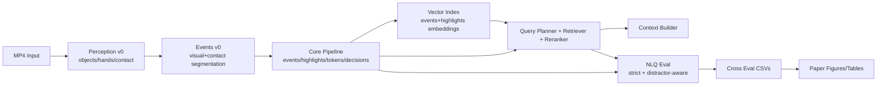

# POV Compiler v0.2.0

POV Compiler turns long first-person videos into compressed, structured, and searchable representations for retrieval, NLQ-style evaluation, and paper-ready reporting.

## Why This Repo

- Layered preprocessing: `perception -> events -> tokens/decisions -> retrieval/index -> eval -> figures`
- Budget-aware compression: keep key moments, preserve explainability
- Queryable IR: supports structured retrieval and hard pseudo-NLQ stress tests
- Reproducible evaluation: cross-variant, strict metrics, distractor-aware analysis

## 5-Minute Quickstart

Replace `<YOUR_EGO4D_ROOT>` with your local dataset path (example: `D:\Ego4D_Dataset`).

### 1) Install

```text
cd /d D:\pov-compiler
python -m pip install -U pip
python -m pip install -r requirements.txt
```

### 2) Stub Perception End-to-End (fast sanity)

```text
python scripts\ego4d_smoke.py --root "<YOUR_EGO4D_ROOT>" --out_dir data\outputs\quick_stub --n 1 --seed 0 --no-proxy --prefer-short --max-duration-s 120 --probe-candidates 50 --run-perception --perception-backend stub --perception-fps 5 --perception-max-frames 200 --run-eval --run-nlq --nlq-mode hard_pseudo_nlq --no-sweep --jobs 1
```

### 3) Real Perception End-to-End (YOLO26 + MediaPipe Tasks)

Check/download model files only when missing:

```text
if not exist weights mkdir weights
if not exist weights\yolo26n.pt python -c "from ultralytics import YOLO; YOLO('yolo26n.pt')"
if not exist weights\yolo26s.pt python -c "from ultralytics import YOLO; YOLO('yolo26s.pt')"
if not exist assets\mediapipe\hand_landmarker.task python -c "import urllib.request, pathlib; p=pathlib.Path('assets/mediapipe/hand_landmarker.task'); p.parent.mkdir(parents=True, exist_ok=True); urllib.request.urlretrieve('https://storage.googleapis.com/mediapipe-models/hand_landmarker/hand_landmarker/float16/latest/hand_landmarker.task', str(p)); print(p)"
```

Run strict real backend:

```text
python scripts\ego4d_smoke.py --root "<YOUR_EGO4D_ROOT>" --out_dir data\outputs\quick_real --n 1 --seed 0 --no-proxy --prefer-short --max-duration-s 120 --probe-candidates 50 --run-perception --perception-backend real --perception-fps 5 --perception-max-frames 200 --perception-strict --run-eval --run-nlq --nlq-mode hard_pseudo_nlq --no-sweep --jobs 1
```

## Layered Architecture



## Repository Structure

```text
src/pov_compiler/
  perception/          # Stub/Real backend, contact heuristic, runner
  l1_events/           # event segmentation (core + v0)
  l2_tokens/           # semantic token codec
  l3_decisions/        # decision compiler (S-A-C-O + alternatives)
  retrieval/           # planner/retriever/reranker/constraints
  context/             # budget-controlled context builder
  memory/              # highlights + vector index + index builder
  eval/ and bench/     # metrics, ablations, NLQ datasets/evaluator/reporting
scripts/
  run_offline.py, build_index.py, retrieve.py, build_context.py
  ego4d_smoke.py, perception_smoke.py, catalog_videos.py, inspect_ego4d_dir.py
  gen_queries.py, eval_cross.py, eval_nlq.py
  make_paper_figures.py, sweep_reranker.py, debug_rerank.py
configs/
  default.yaml, perception_default.yaml, rerank_default.yaml, hard_constraints_default.yaml
docs/
  ARCHITECTURE.md, CLI.md, OUTPUTS.md, REPRO.md, FAQ.md
```

## Key Scripts (One-Line Guide)

| Script | What it does | Key args | Main outputs |
|---|---|---|---|
| `scripts\run_offline.py` | Single-video offline pipeline | `--video --out --run-perception --perception-backend --perception-strict` | output JSON (`events/highlights/tokens/decisions/perception/events_v0`) |
| `scripts\build_index.py` | Build vector index for events/highlights | `--video --json --out_prefix` | `<prefix>.index.npz`, `<prefix>.index_meta.json` |
| `scripts\gen_queries.py` | Fixed query-set generation from full output | `--json --out --n-time --n-token --n-decision --n-hard-time` | `queries.jsonl` |
| `scripts\eval_cross.py` | Cross-variant evaluation with fixed queries | `--json --queries --out_dir --sweep` | `results_overall.csv`, `results_by_query_type.csv`, `results_per_query.csv`, `report.md` |
| `scripts\eval_nlq.py` | NLQ evaluation (`mock/pseudo/hard_pseudo/ego4d`) | `--json --index --out_dir --mode --sweep --rerank-cfg` | `nlq_results.csv`, `nlq_summary.csv`, `nlq_report.md` |
| `scripts\ego4d_smoke.py` | Batch runner on local Ego4D directory | `--root --out_dir --n --prefer-short --run-perception --run-eval --run-nlq` | manifest + per-video json/cache/eval/nlq/perception + top summary |
| `scripts\catalog_videos.py` | Build video catalog (`duration/fps/resolution`) | `--root --out --jobs` | catalog CSV/JSONL |
| `scripts\inspect_ego4d_dir.py` | Directory tree and MP4 distribution report | `--root --depth --out` | markdown report |
| `scripts\perception_smoke.py` | Single-video perception/events_v0 sanity run | `--video --out_dir --perception-backend --perception-strict` | `perception.json`, `events_v0.json`, `report.md` |
| `scripts\make_paper_figures.py` | Generate paper figures/tables | `--cross_dir --nlq_csv --out_dir --macro_avg/--macro-avg --compare_dir` | `figures/*`, `tables/*`, `snapshot.json` |
| `scripts\sweep_reranker.py` | Search reranker weights for strict objective | `--json_dir --index_dir --mode hard_pseudo_nlq --trials --metric` | `results_sweep.csv`, `best_config.yaml`, `best_report.md` |
| `scripts\debug_rerank.py` | Score decomposition debug for reranker | `--json --index --out --rerank-cfg` | debug CSV + summary logs |
| `scripts\export_bye_events.py` / `scripts\bye_regression_smoke.py` | BYE offline injection export and optional lint/report/regression loop | `--json/--pov_json --out_dir --bye_root --strict` | `events/events_v1.jsonl`, `run_package/`, `logs/`, `snapshot.json` |
| `scripts\compare_bye_metrics.py` | Compare BYE metrics across two smoke outputs (e.g., stub vs real) | `--run_a --run_b --out_dir` | `table_bye_compare.csv`, `table_bye_compare.md` |
| `scripts\run_ab_bye_compare.py` | Reproducible AB runner on fixed UID list (stub vs real) + BYE compare | `--root --uids-file --out_dir [--with-bye]` | `run_stub/`, `run_real/`, `compare/{commands.sh,table_bye_compare.*}` |

## Output Directory Contract

Typical run output root:

```text
data/outputs/<run_name>/
  manifest.jsonl
  summary.csv
  summary.md
  nlq_summary_all.csv
  json/<video_uid>_v03_decisions.json
  cache/<video_uid>.index.npz + .index_meta.json
  eval/<video_uid>/{results_overall.csv,results_by_query_type.csv,results_per_query.csv,report.md}
  nlq/<video_uid>/{nlq_results.csv,nlq_summary.csv,nlq_report.md}
  perception/<video_uid>/{perception.json,events_v0.json,report.md}
  event/<video_uid>/events_v0.json
```

See full field-level schema in `docs/OUTPUTS.md`.

## Metrics: Standard vs Strict

- Standard: `hit_at_k`, `mrr`
- Strict/distractor-aware:
  - `hit_at_k_strict`
  - `hit_at_1_strict`
  - `top1_in_distractor_rate` (or `fp_rate` in some tables)
- Interpretability diagnostics:
  - `top1_kind_highlight_rate`, `top1_kind_token_rate`, `top1_kind_decision_rate`, `top1_kind_event_rate`

## Perception Backends

- `stub`: deterministic lightweight outputs for CI and quick smoke runs
- `real`: Ultralytics YOLO + MediaPipe Tasks HandLandmarker
  - requires: `ultralytics`, `mediapipe`
  - task model: `assets/mediapipe/hand_landmarker.task`
  - strict mode: `--perception-strict` (no fallback, fail fast)
  - fallback mode: `--perception-fallback-stub` (if enabled)

## Models and Resources (Check/On-Demand Download)

- YOLO weights: `yolo26n.pt`, `yolo26s.pt`
- MediaPipe task: `assets/mediapipe/hand_landmarker.task`

Check existing files:

```text
python -c "from pathlib import Path; files=['yolo26n.pt','weights/yolo26n.pt','yolo26s.pt','weights/yolo26s.pt','assets/mediapipe/hand_landmarker.task']; [print(f, Path(f).exists()) for f in files]"
```

Only download if missing (see Quickstart section above).

## Ego4D Data Note

This repo assumes Ego4D is prepared locally by the user. Do not upload or redistribute dataset files from this project.

Example local root (replace with your own path):

```text
D:\Ego4D_Dataset
```

## Implemented Capabilities (Current)

- QueryPlanner cascade retrieval + reranker (intent/constraint aware)
- Hard constraints + relax fallback
- Strict NLQ metrics + distractor-aware evaluation
- Perception v0 (stub + real) and events_v0
- Cross-variant eval + fixed queries
- Paper figures/tables + compare mode (`real vs stub`) + snapshot metadata
- Reranker sweep and debugging tools

## Milestone v0.2+ (R&D Progress)

- `events_v1` IR convergence:
  - unified schema for `EventV1 / Evidence / RetrievalHit / ConstraintTrace`
  - backward-compatible converter from existing outputs
  - index/retriever/context now prioritize `events_v1`
- Safety kernel updates:
  - explicit counting semantics: `count_granularity=row=(variant,budget,query)`
  - safety report now includes `critical_fn_denominator`, `critical_fn_rate`, gate threshold, and gate-enforced flag
  - `eval_nlq` defaults to report-only safety; `--safety-gate` enforces CI-style failure
- Streaming skeleton upgrades:
  - retrieval-only latency and end-to-end latency are both reported
  - step-level telemetry includes `index_size`, `events_v1_added`, `e2e_ms`
- Traceability tooling:
  - `scripts/trace_one_query.py` outputs plan/constraints/filtered counts/score breakdown/top-k hits/evidence spans
- Contact-driven hard pseudo NLQ extension:
  - added interaction-like query family (`hard_pseudo_contact`) to better expose events_v1/perception differences

## Roadmap (Next Suggested Steps)

- Improve token/decision gains on hard pseudo token queries with richer feature fusion
- Add optional FAISS IVF/HNSW backends for larger-scale retrieval benchmarks
- Add calibrated confidence and per-bucket confidence intervals in report layer
- Add automated CI jobs for docs command validation and smoke dry-runs

## More Documentation

- `docs/ARCHITECTURE.md`
- `docs/CLI.md`
- `docs/OUTPUTS.md`
- `docs/REPRO.md`
- `docs/FAQ.md`
- `docs/BYE_INJECTION.md`
