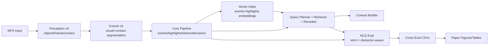

# POV Compiler v0.2.0

POV Compiler turns long first-person videos into compressed, structured, and searchable representations for retrieval, NLQ-style evaluation, and paper-ready reporting.

## Why This Repo

- Layered preprocessing: `perception -> events -> tokens/decisions -> retrieval/index -> eval -> figures`
- Budget-aware compression: keep key moments, preserve explainability
- Queryable IR: supports structured retrieval and hard pseudo-NLQ stress tests
- Reproducible evaluation: cross-variant, strict metrics, distractor-aware analysis

## 5-Minute Quickstart

Replace `<YOUR_EGO4D_ROOT>` with your local dataset path (example: `D:\Ego4D_Dataset`).

### 1) Install

```text
cd /d D:\pov-compiler
python -m pip install -U pip
python -m pip install -r requirements.txt
```

### 2) Stub Perception End-to-End (fast sanity)

```text
python scripts\ego4d_smoke.py --root "<YOUR_EGO4D_ROOT>" --out_dir data\outputs\quick_stub --n 1 --seed 0 --no-proxy --prefer-short --max-duration-s 120 --probe-candidates 50 --run-perception --perception-backend stub --perception-fps 5 --perception-max-frames 200 --run-eval --run-nlq --nlq-mode hard_pseudo_nlq --no-sweep --jobs 1
```

### 3) Real Perception End-to-End (YOLO26 + MediaPipe Tasks)

Check/download model files only when missing:

```text
if not exist weights mkdir weights
if not exist weights\yolo26n.pt python -c "from ultralytics import YOLO; YOLO('yolo26n.pt')"
if not exist weights\yolo26s.pt python -c "from ultralytics import YOLO; YOLO('yolo26s.pt')"
if not exist assets\mediapipe\hand_landmarker.task python -c "import urllib.request, pathlib; p=pathlib.Path('assets/mediapipe/hand_landmarker.task'); p.parent.mkdir(parents=True, exist_ok=True); urllib.request.urlretrieve('https://storage.googleapis.com/mediapipe-models/hand_landmarker/hand_landmarker/float16/latest/hand_landmarker.task', str(p)); print(p)"
```

Run strict real backend:

```text
python scripts\ego4d_smoke.py --root "<YOUR_EGO4D_ROOT>" --out_dir data\outputs\quick_real --n 1 --seed 0 --no-proxy --prefer-short --max-duration-s 120 --probe-candidates 50 --run-perception --perception-backend real --perception-fps 5 --perception-max-frames 200 --perception-strict --run-eval --run-nlq --nlq-mode hard_pseudo_nlq --no-sweep --jobs 1
```

## Layered Architecture



## Repository Structure

```text
src/pov_compiler/
  perception/          # Stub/Real backend, contact heuristic, runner
  l1_events/           # event segmentation (core + v0)
  l2_tokens/           # semantic token codec
  l3_decisions/        # decision compiler (S-A-C-O + alternatives)
  retrieval/           # planner/retriever/reranker/constraints
  context/             # budget-controlled context builder
  memory/              # highlights + vector index + index builder
  eval/ and bench/     # metrics, ablations, NLQ datasets/evaluator/reporting
scripts/
  run_offline.py, build_index.py, retrieve.py, build_context.py
  ego4d_smoke.py, perception_smoke.py, catalog_videos.py, inspect_ego4d_dir.py
  gen_queries.py, eval_cross.py, eval_nlq.py
  make_paper_figures.py, sweep_reranker.py, debug_rerank.py
configs/
  default.yaml, perception_default.yaml, rerank_default.yaml, hard_constraints_default.yaml
docs/
  ARCHITECTURE.md, CLI.md, OUTPUTS.md, REPRO.md, FAQ.md
```

## Key Scripts (One-Line Guide)

| Script | What it does | Key args | Main outputs |
|---|---|---|---|
| `scripts\run_offline.py` | Single-video offline pipeline | `--video --out --run-perception --perception-backend --perception-strict` | output JSON (`events/highlights/tokens/decisions/perception/events_v0`) |
| `scripts\build_index.py` | Build vector index for events/highlights | `--video --json --out_prefix` | `<prefix>.index.npz`, `<prefix>.index_meta.json` |
| `scripts\gen_queries.py` | Fixed query-set generation from full output | `--json --out --n-time --n-token --n-decision --n-hard-time` | `queries.jsonl` |
| `scripts\eval_cross.py` | Cross-variant evaluation with fixed queries | `--json --queries --out_dir --sweep` | `results_overall.csv`, `results_by_query_type.csv`, `results_per_query.csv`, `report.md` |
| `scripts\eval_nlq.py` | NLQ evaluation (`mock/pseudo/hard_pseudo/ego4d`) | `--json --index --out_dir --mode --sweep --rerank-cfg` | `nlq_results.csv`, `nlq_summary.csv`, `nlq_report.md` |
| `scripts\ego4d_smoke.py` | Batch runner on local Ego4D directory | `--root --out_dir --n --prefer-short --run-perception --run-eval --run-nlq` | manifest + per-video json/cache/eval/nlq/perception + top summary |
| `scripts\catalog_videos.py` | Build video catalog (`duration/fps/resolution`) | `--root --out --jobs` | catalog CSV/JSONL |
| `scripts\inspect_ego4d_dir.py` | Directory tree and MP4 distribution report | `--root --depth --out` | markdown report |
| `scripts\perception_smoke.py` | Single-video perception/events_v0 sanity run | `--video --out_dir --perception-backend --perception-strict` | `perception.json`, `events_v0.json`, `report.md` |
| `scripts\make_paper_figures.py` | Generate paper figures/tables | `--cross_dir --nlq_csv --out_dir --macro_avg/--macro-avg --compare_dir` | `figures/*`, `tables/*`, `snapshot.json` |
| `scripts\sweep_reranker.py` | Sweep decision-aligned reranker weights (strict+distractor+safety objective) | `--run_dir (or --json --index) --nlq-mode --grid/--w-*-list --alpha --beta` | `aggregate/metrics_by_weights.*`, `best_weights.yaml`, `best_report.md`, `figures/fig_tradeoff_*`, `snapshot.json` |
| `scripts\debug_rerank.py` | Score decomposition debug for reranker | `--json --index --out --rerank-cfg` | debug CSV + summary logs |
| `scripts\export_bye_events.py` / `scripts\bye_regression_smoke.py` | BYE offline injection export and optional lint/report/regression loop | `--json/--pov_json --out_dir --bye_root --bye-collect-report --bye-gate --max-bye-critical-fn --strict` | `events/events_v1.jsonl`, `run_package/`, `logs/`, `bye_metrics.*`, `bye_report_metrics.json`, `snapshot.json` |
| `scripts\sweep_bye_budgets.py` | BYE metrics over budget points (strict UID matching by default) | `--pov-json-dir --uids-file --budgets --out-dir [--strict-uids]` | `aggregate/metrics_by_budget.*`, `figures/fig_bye_*`, `snapshot.json` |
| `scripts\compare_bye_budget_sweeps.py` | Compare two BYE budget sweeps (A/B curve + delta) | `--a_dir/--a_csv --b_dir/--b_csv --out_dir --primary-metric` | `tables/table_budget_compare.*`, `figures/fig_bye_primary_*`, `compare_summary.json` |
| `scripts\compare_bye_report_metrics.py` | Compare BYE report-panel metrics (primary/critical_fn/latency) between two runs | `--a-dir --b-dir --out_dir --a-label --b-label` | `tables/table_bye_report_compare.*`, `figures/fig_bye_critical_fn_delta.*`, `figures/fig_bye_latency_delta.*`, `compare_summary.json` |
| `scripts\sweep_nlq_budgets.py` | NLQ hard/pseudo evaluation over explicit budget points (strict UID matching by default) | `--json_dir --index_dir --uids-file --budgets --out_dir` | `aggregate/metrics_by_budget.*`, `figures/fig_nlq_*`, `snapshot.json` |
| `scripts\sweep_streaming_budgets.py` | Streaming online simulation budget sweep (fixed/adaptive) | `--json_dir --uids-file --budgets --out_dir --policy` | `aggregate/metrics_by_budget.*`, `figures/fig_streaming_quality_*`, `snapshot.json` |
| `scripts\sweep_streaming_codec_k.py` | Fixed-K Streaming Codec baseline sweep (`codec=fixed_k`) with quality/safety/latency curves | `--json/--json_dir --k-list --budgets --policy --out_dir` | `aggregate/metrics_by_k.*`, `figures/fig_streaming_*_vs_k.*`, `snapshot.json` |
| `scripts\recommend_budget.py` | Multi-objective budget recommender (BYE + NLQ curves with gates) | `--bye_csv/--bye_dir --nlq_csv/--nlq_dir --out_dir` | `tables/table_budget_recommend.*`, `figures/fig_objective_*`, `recommend_summary.json` |
| `scripts\export_paper_ready.py` | Unified BYE/NLQ/Streaming budget panel export (paper-ready tables/figures) | `--compare_dir --out_dir --label_a --label_b [--reranker-sweep-dir]` | `tables/table_budget_panel*`, `figures/fig_budget_*`, `report.md`, `snapshot.json` |
| `scripts\streaming_budget_smoke.py` | Streaming/online budget policy simulation (`fixed/recommend/adaptive/safety_latency/safety_latency_chain/safety_latency_intervention`) with strict+safety metrics and switch traces | `--json --out_dir --budgets --policy [--fixed-budget|--recommend-dir|--latency-cap-ms|--min-chain-success-rate|--intervention-cfg]` | `steps.csv`, `queries.csv`, `figures/fig_policy_*` (+ chain mode: `fig_streaming_chain_*`), `report.md`, `snapshot.json` |
| `scripts\run_streaming_policy_compare.py` | One-click baseline vs intervention streaming compare harness (`safety_latency` vs `safety_latency_intervention`) | `--json --out_dir --budgets --query ... --max-trials` | `run_a/*`, `run_b/*`, `compare/tables/table_streaming_policy_compare.*`, `compare/figures/fig_streaming_policy_compare_*`, `compare_summary.json`, `snapshot.json` |
| `scripts\sweep_streaming_interventions.py` | Random/grid sweep over intervention config to optimize strict+safety+latency objective | `--json --out_dir --budgets --trials --base-cfg --query ...` | `results_sweep.csv`, `best_config.yaml`, `best_report.md`, `figures/fig_objective_vs_latency*`, `snapshot.json` |
| `scripts\place_interaction_smoke.py` | AMEGO-style place-segment and interaction-signature smoke summary (`events_v1` focus) | `--json --out_dir [--n --seed]` | `place_segments.json`, `interaction_summary.csv`, `report.md`, `snapshot.json` |
| `scripts\repo_policy_smoke.py` | RepoV1 write/read/dedup smoke with configurable policies (`fixed_interval/event_triggered/novelty` + `budgeted_topk/diverse`) | `--json --out_dir [--repo-cfg] [--query ...]` | `repo_chunks.jsonl`, `repo_selected.jsonl`, `context.txt`, `report.md`, `snapshot.json` |
| `scripts\sweep_repo_policies.py` | RepoV1 policy × budget sweep (`write_policy × read_policy × budgets`) | `--pov-json-dir --uids-file --budgets --out_dir --write-policies --read-policies` | `aggregate/metrics_by_setting.*`, `figures/fig_repo_*`, `best_report.md`, `snapshot.json` |
| `scripts\sweep_repo_query_selection.py` | Repo query-time selection sweep (`baseline` vs `query_aware`) with strict+distractor-style metrics | `--pov-json-dir --uids-file --budgets --policies --queries-file --out_dir` | `aggregate/metrics_by_policy_budget.*`, `figures/fig_repo_query_selection_*`, `best_report.md`, `snapshot.json` |
| `scripts\repo_smoke.py` | RepoV0 legacy smoke (kept for backward compatibility) | `--json --out_dir [--query]` | `repo_chunks.jsonl`, `repo_selected.jsonl`, `report.md`, `snapshot.json` |
| `scripts\sweep_repo_budgets.py` | RepoV0 legacy budget sweep | `--json --out_dir --budgets` | `aggregate/metrics_by_budget.*`, `figures/fig_repo_quality_vs_budget_seconds.*`, `snapshot.json` |
| `scripts\compare_bye_metrics.py` | Compare BYE metrics across two smoke outputs (e.g., stub vs real) | `--run_a --run_b --out_dir` | `table_bye_compare.csv`, `table_bye_compare.md` |
| `scripts\run_ab_bye_compare.py` | Reproducible AB runner with optional BYE/NLQ/streaming budget sweeps, BYE report panel compare, reranker sweep, and recommendation | `--root --out_dir [--uids-file] --with-bye --with-bye-report --bye-gate --max-bye-critical-fn --with-bye-budget-sweep --with-nlq-budget-sweep --with-reranker-sweep` | `run_stub/`, `run_real/`, `compare/bye/*`, `compare/bye_report/*`, `compare/bye_budget/*`, `compare/nlq_budget/*`, `compare/reranker_sweep/*`, `compare/budget_recommend/*` |
| `scripts\run_component_attribution.py` | Component Attribution Panel (A/B/C/D) for Repo vs Perception vs Streaming contribution under same UID/budget/query set | `--root --uids-file --out_dir --budgets --with-nlq --with-streaming-budget --with-perception` | `run_A/..run_D/`, `compare/tables/table_component_attribution.*`, `compare/figures/fig_component_attribution_*`, `compare_summary.json`, `snapshot.json` |

## Output Directory Contract

Typical run output root:

```text
data/outputs/<run_name>/
  manifest.jsonl
  summary.csv
  summary.md
  nlq_summary_all.csv
  json/<video_uid>_v03_decisions.json
  cache/<video_uid>.index.npz + .index_meta.json
  eval/<video_uid>/{results_overall.csv,results_by_query_type.csv,results_per_query.csv,report.md}
  nlq/<video_uid>/{nlq_results.csv,nlq_summary.csv,nlq_report.md}
  perception/<video_uid>/{perception.json,events_v0.json,report.md}
  event/<video_uid>/events_v0.json
```

See full field-level schema in `docs/OUTPUTS.md`.

## Metrics: Standard vs Strict

- Standard: `hit_at_k`, `mrr`
- Strict/distractor-aware:
  - `hit_at_k_strict`
  - `hit_at_1_strict`
  - `top1_in_distractor_rate` (or `fp_rate` in some tables)
- Interpretability diagnostics:
  - `top1_kind_highlight_rate`, `top1_kind_token_rate`, `top1_kind_decision_rate`, `top1_kind_event_rate`

## Perception Backends

- `stub`: deterministic lightweight outputs for CI and quick smoke runs
- `real`: Ultralytics YOLO + MediaPipe Tasks HandLandmarker
  - requires: `ultralytics`, `mediapipe`
  - task model: `assets/mediapipe/hand_landmarker.task`
  - strict mode: `--perception-strict` (no fallback, fail fast)
  - fallback mode: `--perception-fallback-stub` (if enabled)

## Models and Resources (Check/On-Demand Download)

- YOLO weights: `yolo26n.pt`, `yolo26s.pt`
- MediaPipe task: `assets/mediapipe/hand_landmarker.task`

Check existing files:

```text
python -c "from pathlib import Path; files=['yolo26n.pt','weights/yolo26n.pt','yolo26s.pt','weights/yolo26s.pt','assets/mediapipe/hand_landmarker.task']; [print(f, Path(f).exists()) for f in files]"
```

Only download if missing (see Quickstart section above).

## Ego4D Data Note

This repo assumes Ego4D is prepared locally by the user. Do not upload or redistribute dataset files from this project.

Example local root (replace with your own path):

```text
D:\Ego4D_Dataset
```

## Implemented Capabilities (Current)

- QueryPlanner cascade retrieval + reranker (intent/constraint aware)
- Hard constraints + relax fallback
- Strict NLQ metrics + distractor-aware evaluation
- Perception v0 (stub + real) and events_v0
- Place segment + interaction signature promoted to `events_v1` first-class fields
- Cross-variant eval + fixed queries
- Paper figures/tables + compare mode (`real vs stub`) + snapshot metadata
- Reranker sweep and debugging tools

## Milestone v0.2+ (R&D Progress)

- `events_v1` IR convergence:
  - unified schema for `EventV1 / Evidence / RetrievalHit / ConstraintTrace`
  - backward-compatible converter from existing outputs
  - index/retriever/context now prioritize `events_v1`
- Safety kernel updates:
  - explicit counting semantics: `count_granularity=row=(variant,budget,query)`
  - safety report now includes `critical_fn_denominator`, `critical_fn_rate`, gate threshold, and gate-enforced flag
  - `eval_nlq` defaults to report-only safety; `--safety-gate` enforces CI-style failure
- Streaming skeleton upgrades:
  - retrieval-only latency and end-to-end latency are both reported
  - step-level telemetry includes `index_size`, `events_v1_added`, `e2e_ms`
- Traceability tooling:
  - `scripts/trace_one_query.py` outputs plan/constraints/filtered counts/score breakdown/top-k hits/evidence spans
- Contact-driven hard pseudo NLQ extension:
  - added interaction-like query family (`hard_pseudo_contact`) to better expose events_v1/perception differences
- AMEGO-style v1.14 extension:
  - added `hard_pseudo_place` and `hard_pseudo_interaction` families
  - retrieval/query constraints now support `place=*`, `place_segment_id=*`, `interaction_min=*`, `interaction_object=*`
  - trace includes place-segment hit distribution and interaction top-k diagnostics

## Roadmap (Next Suggested Steps)

- Improve token/decision gains on hard pseudo token queries with richer feature fusion
- Add optional FAISS IVF/HNSW backends for larger-scale retrieval benchmarks
- Add calibrated confidence and per-bucket confidence intervals in report layer
- Add automated CI jobs for docs command validation and smoke dry-runs

## More Documentation

- `docs/ARCHITECTURE.md`
- `docs/CLI.md`
- `docs/OUTPUTS.md`
- `docs/REPRO.md`
- `docs/FAQ.md`
- `docs/BYE_INJECTION.md`

## AB v1.2 Quick Command

Run reproducible stub vs real on the same UID list (optional perception/NLQ/figs/BYE):

```text
python scripts\run_ab_bye_compare.py --root "<YOUR_EGO4D_ROOT>" --uids-file data\outputs\uids.txt --out_dir data\outputs\ab_v12 --with-perception --stub-perception-backend stub --real-perception-backend real --with-eval --with-nlq --nlq-mode hard_pseudo_nlq --with-figs --with-bye --with-bye-report --bye-root "<YOUR_BYE_ROOT>" --bye-gate --max-bye-critical-fn 1 --bye-skip-regression --with-bye-budget-sweep --bye-budgets "20/50/4,40/100/8,60/200/12" --bye-primary-metric qualityScore --with-nlq-budget-sweep --nlq-budgets "20/50/4,40/100/8,60/200/12" --with-budget-recommend
```

v1.7 unified budget panel (BYE/NLQ/Streaming + paper-ready export):

```text
python scripts\run_ab_bye_compare.py --root "<YOUR_EGO4D_ROOT>" --uids-file data\outputs\uids.txt --out_dir data\outputs\ab_v17 --with-perception --stub-perception-backend stub --real-perception-backend real --with-nlq --nlq-mode hard_pseudo_nlq --with-streaming-budget --streaming-step-s 8 --with-bye --bye-root "<YOUR_BYE_ROOT>" --with-bye-budget-sweep --with-nlq-budget-sweep --with-budget-recommend --export-paper-ready
```

Main artifacts:
- `data/outputs/ab_v12/run_stub/summary.csv`
- `data/outputs/ab_v12/run_real/summary.csv`
- `data/outputs/ab_v12/compare/bye/table_bye_compare.md`
- `data/outputs/ab_v12/compare/bye_report/tables/table_bye_report_compare.md`
- `data/outputs/ab_v12/compare/bye_budget/compare/tables/table_budget_compare.md`
- `data/outputs/ab_v12/compare/bye_budget/compare/figures/fig_bye_primary_vs_budget_seconds_compare.png`
- `data/outputs/ab_v12/compare/nlq_budget/stub/aggregate/metrics_by_budget.csv`
- `data/outputs/ab_v12/compare/nlq_budget/real/aggregate/metrics_by_budget.csv`
- `data/outputs/ab_v12/compare/streaming_budget/stub/aggregate/metrics_by_budget.csv`
- `data/outputs/ab_v12/compare/streaming_budget/real/aggregate/metrics_by_budget.csv`
- `data/outputs/ab_v12/compare/budget_recommend/stub/tables/table_budget_recommend.md`
- `data/outputs/ab_v12/compare/budget_recommend/real/tables/table_budget_recommend.md`
- `data/outputs/ab_v12/compare/paper_ready/tables/table_budget_panel.md`

### v1.20 BYE Report Panel + Gate

Fake BYE smoke (CI/local debug):

```text
python scripts\run_ab_bye_compare.py --root data\outputs\v120_fake\ego_root --uids-file data\outputs\v120_fake\uids.txt --out_dir data\outputs\v120_fake\ab_v120_demo --with-bye --with-bye-report --bye-root data\outputs\v120_fake\fake_bye --bye-skip-regression --with-bye-budget-sweep --bye-budgets "20/50/4,40/100/8" --with-nlq-budget-sweep --nlq-budgets "20/50/4,40/100/8" --with-budget-recommend --with-streaming-budget --export-paper-ready --nlq-eval-script data\outputs\v120_fake\fake_eval_nlq.py
```

Real BYE repo (if available):

```text
python scripts\run_ab_bye_compare.py --root "<YOUR_EGO4D_ROOT>" --uids-file data\outputs\uids.txt --out_dir data\outputs\ab_v120_real --with-bye --with-bye-report --bye-root "<YOUR_BYE_ROOT>" --bye-gate --max-bye-critical-fn 1 --bye-skip-regression --export-paper-ready
```

Key BYE report outputs:
- `.../compare/bye_report/tables/table_bye_report_compare.md`
- `.../compare/bye_report/figures/fig_bye_critical_fn_delta.png`
- `.../compare/bye_report/figures/fig_bye_latency_delta.png`
- `.../compare/paper_ready/bye_report/table_bye_report_compare.md`

## v1.18 Streaming + Repo Query-Aware Compare

Run non-repo vs repo-aware streaming on the same budgets/queries:

```text
python scripts\run_streaming_repo_compare.py --json data/outputs/ego4d_ab_real_n6/json/000a3525-6c98-4650-aaab-be7d2c7b9402_v03_decisions.json --out_dir data/outputs/streaming_repo_compare_v118_demo --step-s 8 --budgets "20/50/4,60/200/12" --query "anchor=turn_head top_k=6" --query "decision=ATTENTION_TURN_HEAD top_k=6" --policy-a safety_latency_intervention --policy-b safety_latency_intervention --a-use-repo false --b-use-repo true --b-repo-policy query_aware
```

Optional paper-ready ingest:

```text
python scripts\export_paper_ready.py --compare_dir data/outputs/ab_v17_demo/compare --out_dir data/outputs/paper_ready_v118_demo --streaming-repo-compare-dir data/outputs/streaming_repo_compare_v118_demo/compare
```

Key outputs:
- `.../streaming_repo_compare_v118_demo/run_a/queries.csv`
- `.../streaming_repo_compare_v118_demo/run_b/queries.csv`
- `.../streaming_repo_compare_v118_demo/compare/tables/table_streaming_repo_compare.csv`
- `.../streaming_repo_compare_v118_demo/compare/figures/fig_streaming_repo_compare_safety_latency.png`
- `data/outputs/ab_v12/compare/paper_ready/figures/fig_budget_primary_vs_seconds_panel.png`
- `data/outputs/ab_v12/compare/paper_figs_compare/`

## v1.19 Component Attribution Panel

Run four fixed settings on the same UID list and budgets:

- `A`: baseline (stub perception + non-repo)
- `B`: `A + repo(query_aware)`
- `C`: `A + real perception(strict)`
- `D`: `A + repo + real perception(strict)`

```text
python scripts\run_component_attribution.py --root "<YOUR_EGO4D_ROOT>" --uids-file data\outputs\uids_match_real_n6.txt --out_dir data\outputs\component_attr_v119_demo --jobs 1 --budgets "20/50/4,60/200/12" --with-nlq --nlq-mode hard_pseudo_nlq --with-perception --perception-fps 5 --perception-max-frames 300 --real-perception-backend real --real-perception-strict --stub-perception-backend stub --with-streaming-budget --streaming-step-s 8 --query "anchor=turn_head top_k=6" --query "decision=ATTENTION_TURN_HEAD top_k=6"
```

Key outputs:
- `.../component_attr_v119_demo/compare/tables/table_component_attribution.csv`
- `.../component_attr_v119_demo/compare/figures/fig_component_attribution_delta.png`
- `.../component_attr_v119_demo/compare/figures/fig_component_attribution_tradeoff.png`
- `.../component_attr_v119_demo/compare/compare_summary.json`

## Streaming Budget Policy (v1.6)

Fixed budget:

```text
python scripts\streaming_budget_smoke.py --json data\outputs\ego4d_ab_real_n6\json\<uid>_v03_decisions.json --out_dir data\outputs\streaming_budget_fixed --step-s 8 --budgets "20/50/4,40/100/8,60/200/12" --budget-policy fixed --fixed-budget 40/100/8
```

Recommended budget (from v1.5 recommender output):

```text
python scripts\streaming_budget_smoke.py --json data\outputs\ego4d_ab_real_n6\json\<uid>_v03_decisions.json --out_dir data\outputs\streaming_budget_recommend --step-s 8 --budgets "20/50/4,40/100/8,60/200/12" --budget-policy recommend --recommend-dir data\outputs\ab_v15_demo\compare\budget_recommend\real
```

Adaptive minimum budget:

```text
python scripts\streaming_budget_smoke.py --json data\outputs\ego4d_ab_real_n6\json\<uid>_v03_decisions.json --out_dir data\outputs\streaming_budget_adaptive --step-s 8 --budgets "20/50/4,40/100/8,60/200/12" --budget-policy adaptive
```

## Streaming Safety+Latency Policy (v1.9)

Safety-latency constrained online policy (latency cap + strict+safety objective):

```text
python scripts\streaming_budget_smoke.py --json data\outputs\ego4d_ab_real_n6\json\<uid>_v03_decisions.json --out_dir data\outputs\streaming_budget_v19 --step-s 8 --budgets "20/50/4,40/100/8,60/200/12" --policy safety_latency --latency-cap-ms 5 --max-trials-per-query 3 --query "anchor=turn_head top_k=6" --query "decision=ATTENTION_TURN_HEAD top_k=6"
```

Key outputs:
- `data/outputs/streaming_budget_v19/steps.csv`
- `data/outputs/streaming_budget_v19/queries.csv` (trial-level `action/safety_reason/final_trial`)
- `data/outputs/streaming_budget_v19/figures/fig_policy_budget_over_queries.png`
- `data/outputs/streaming_budget_v19/figures/fig_policy_safety_vs_latency.png`
- `data/outputs/streaming_budget_v19/report.md`
- `data/outputs/streaming_budget_v19/snapshot.json`

## Streaming Safety Intervention Policy (v1.10)

Intervention policy with attribution-driven online repair chain (`relax_constraints/switch_rerank_cfg/expand_candidates/escalate_budget`):

```text
python scripts\streaming_budget_smoke.py --json data\outputs\ego4d_ab_real_n6\json\<uid>_v03_decisions.json --out_dir data\outputs\streaming_budget_v110_demo --policy safety_latency_intervention --step-s 8 --budgets "20/50/4,60/200/12,120/400/24" --max-trials 5 --query "anchor=turn_head top_k=6" --query "token=TURN_HEAD top_k=6" --query "decision=ATTENTION_TURN_HEAD top_k=6"
```

Key outputs:
- `steps.csv`, `queries.csv`, `interventions.csv`
- `figures/fig_policy_interventions_over_queries.png`
- `figures/fig_policy_intervention_breakdown.png`
- `figures/fig_policy_budget_over_queries.png`
- `figures/fig_policy_safety_vs_latency.png`
- `report.md`, `snapshot.json`

Default intervention config:
- `configs/streaming_intervention_default.yaml`

Override config in smoke:

```text
python scripts\streaming_budget_smoke.py --json data\outputs\ego4d_ab_real_n6\json\<uid>_v03_decisions.json --out_dir data\outputs\streaming_budget_cfg --policy safety_latency_intervention --budgets "20/50/4,60/200/12,120/400/24" --intervention-cfg configs/streaming_intervention_default.yaml
```

## Streaming Policy Compare Harness (v1.11)

Run baseline vs intervention on the same input/query/budget setup:

```text
python scripts\run_streaming_policy_compare.py --json data\outputs\ego4d_ab_real_n6\json\<uid>_v03_decisions.json --out_dir data\outputs\streaming_policy_compare_v111 --step-s 8 --budgets "20/50/4,60/200/12,120/400/24" --max-trials 5 --intervention-cfg configs/streaming_intervention_default.yaml --query "anchor=turn_head top_k=6" --query "token=TURN_HEAD top_k=6" --query "decision=ATTENTION_TURN_HEAD top_k=6"
```

Key outputs:
- `run_a/` (baseline policy run)
- `run_b/` (intervention policy run)
- `compare/tables/table_streaming_policy_compare.csv`
- `compare/figures/fig_streaming_policy_compare_safety_latency.png`
- `compare/figures/fig_streaming_policy_compare_delta.png`
- `compare/compare_summary.json`, `compare/snapshot.json`, `compare/commands.sh`

## Decision-Aligned Reranker (v1.13)

Trace one query with semantic vs decision-aligned decomposition:

```text
python scripts\trace_one_query.py --json data\outputs\ego4d_ab_real_n6\json\<uid>_v03_decisions.json --index data\outputs\ego4d_ab_real_n6\cache\<uid> --query "decision=ATTENTION_TURN_HEAD top_k=6" --out_dir data\outputs\trace_v113
```

Sweep decision-aligned weights:

```text
python scripts\sweep_reranker.py --run_dir data\outputs\ego4d_ab_real_n6 --out_dir data\outputs\reranker_sweep_demo --nlq-mode hard_pseudo_nlq --grid "w_trigger=0.2,0.6;w_action=0.2,0.6;w_constraint=0.1,0.3;w_outcome=0.1;w_evidence=0.1,0.3;w_semantic=1.0" --top-k 6 --seed 0
```

Optional AB hook:

```text
python scripts\run_ab_bye_compare.py --root "<YOUR_EGO4D_ROOT>" --uids-file data\outputs\uids.txt --out_dir data\outputs\ab_v113 --with-nlq --with-reranker-sweep --reranker-sweep-grid "w_trigger=0.2,0.8;w_action=0.3"
```

## RepoV1 (LangRepo-style write/read policy)

RepoV1 upgrades repository memory to explicit `WritePolicy + ReadPolicy` with multi-scale chunks (`event/decision/place`) and cross-scale dedup.  
LangRepo mapping in this repo: `writer(policy) -> chunks`, `dedup(reasoned) -> compact memory`, `reader(policy,budget,query) -> selected context`.

Single-video RepoV1 smoke:

```text
python scripts\repo_policy_smoke.py --json data\outputs\ego4d_ab_real_n6\json\<uid>_v03_decisions.json --out_dir data\outputs\repo_policy_smoke_v116_demo --query "anchor=turn_head top_k=6"
```

RepoV1 policy × budget sweep:

```text
python scripts\sweep_repo_policies.py --pov-json-dir data\outputs\ego4d_ab_real_n6\json --uids-file data\outputs\ab_v12_uids.txt --out_dir data\outputs\repo_policy_sweep_v116_demo --budgets "20/50/4,60/200/12" --write-policies "fixed_interval,event_triggered,novelty" --read-policies "budgeted_topk,diverse"
```

Paper-ready integration (optional):

```text
python scripts\export_paper_ready.py --compare_dir data\outputs\ab_v17_demo\compare --out_dir data\outputs\ab_v17_demo\compare\paper_ready --repo-policy-sweep-dir data\outputs\repo_policy_sweep_v116_demo
```

## Repo Query-Aware Selection (v1.17)

Trace with query-aware repo read policy and selection reasons:

```text
python scripts\trace_one_query.py --json data\outputs\ego4d_ab_real_n6\json\<uid>_v03_decisions.json --query "place=first interaction_min=0.30 interaction_object=door top_k=6" --out_dir data\outputs\trace_repo_queryaware_v117_demo --use-repo
```

Sweep baseline vs query-aware under the same budgets and queries:

```text
python scripts\sweep_repo_query_selection.py --pov-json-dir data\outputs\ego4d_ab_real_n6\json --uids-file data\outputs\uids_match_repo_v116.txt --out_dir data\outputs\repo_query_selection_sweep_v117_demo --budgets "20/50/4,60/200/12" --policies "baseline,query_aware" --top-k 6
```

Paper-ready integration (optional):

```text
python scripts\export_paper_ready.py --compare_dir data\outputs\ab_v17_demo\compare --out_dir data\outputs\ab_v17_demo\compare\paper_ready --repo-query-selection-sweep-dir data\outputs\repo_query_selection_sweep_v117_demo
```

## Place + Interaction IR (v1.14)

Trace with place/interaction constraints:

```text
python scripts\trace_one_query.py --json data\outputs\ego4d_ab_real_n6\json\<uid>_v03_decisions.json --index data\outputs\ego4d_ab_real_n6\cache\<uid> --query "place=first interaction_min=0.30 interaction_object=door top_k=6" --out_dir data\outputs\trace_v114
```

Smoke summary:

```text
python scripts\place_interaction_smoke.py --json data\outputs\ego4d_ab_real_n6\json --out_dir data\outputs\place_interaction_smoke_demo --n 1 --seed 0 --perception_dir data\outputs\ego4d_ab_real_n6\perception
```

Notes:
- If `interaction_score_mean` and object vocab stay `0`, it usually means perception outputs are missing or you are using stub-only inputs.
- To enforce non-zero interaction checks, run with `--require_interaction` (the script will fail fast with a hint).

## Fixed-K Streaming Codec (v1.15)

Sweep constant-K memory writing baseline:

```text
python scripts\sweep_streaming_codec_k.py --json data\outputs\ego4d_ab_real_n6\json\<uid>_v03_decisions.json --out_dir data\outputs\streaming_codec_k_demo --k-list "4,8,16" --budgets "20/50/4,40/100/8,60/200/12" --policy safety_latency_intervention
```

Outputs:
- `aggregate/metrics_by_k.csv`, `aggregate/metrics_by_k.md`
- `figures/fig_streaming_quality_vs_k.*`
- `figures/fig_streaming_safety_vs_k.*`
- `figures/fig_streaming_latency_vs_k.*`

## Active Memory / Lost Object (v1.21)

Build object memory from perception and generate/evaluate lost-object queries:

```text
python scripts\object_memory_smoke.py --pov_json data\outputs\ego4d_ab_real_n6\json\<uid>_v03_decisions.json --out_dir data\outputs\object_memory_smoke_v121_demo --n 1 --seed 0
```

Trace a structured lost-object query with constraints:

```text
python scripts\trace_one_query.py --json data\outputs\ego4d_ab_real_n6\json\<uid>_v03_decisions.json --query "lost_object=door top_k=6" --out_dir data\outputs\trace_lost_object_v121 --enable-constraints
```

Key outputs:
- `<out_dir>/<uid>/object_memory.json`
- `<out_dir>/<uid>/lost_object_queries.json`
- `<out_dir>/nlq_report.md`
- `<out_dir>/snapshot.json`

Optional paper-ready integration:

```text
python scripts\export_paper_ready.py --compare_dir data\outputs\ab_v17_demo\compare --out_dir data\outputs\ab_v17_demo\compare\paper_ready --lost-object-panel-dir data\outputs\ab_v17_demo\compare\nlq_budget\real\aggregate
```

### Chain Query v2 (derived constraints + attribution)

```text
python scripts\trace_one_query.py --json data\outputs\ego4d_ab_real_n6\json\<uid>_v03_decisions.json --out_dir data\outputs\trace_chain_v124_demo --query "place=first interaction_object=door interaction_min=0.30 then token=SCENE_CHANGE which=first top_k=6 chain_derive=time+place+object chain_place_mode=hard chain_object_mode=soft"
python scripts\eval_nlq.py --json data\outputs\ego4d_ab_real_n6\json\<uid>_v03_decisions.json --index data\outputs\ego4d_ab_real_n6\cache\<uid> --out_dir data\outputs\nlq_chain_v124_demo --mode hard_pseudo_chain --n 6 --seed 0 --top-k 6

# v1.25 streaming chain-aware budget policy
python scripts\streaming_budget_smoke.py --json data\outputs\ego4d_ab_real_n6\json\<uid>_v03_decisions.json --out_dir data\outputs\streaming_chain_v125_demo --policy safety_latency_chain --budgets "20/50/4,60/200/12" --step-s 8 --query "lost_object=door which=last top_k=6 then token=SCENE_CHANGE which=last top_k=6 chain_derive=time+object chain_object_mode=hard"
```

Chain mode now emits:
- `table_chain_summary.(csv/md)`
- `table_chain_failure_attribution.(csv/md)`
- `fig_chain_success_vs_budget_seconds.(png/pdf)`
- `fig_chain_failure_attribution_vs_budget_seconds.(png/pdf)`
- `fig_chain_success_vs_derive.(png/pdf)`
- streaming chain policy smoke also exports:
  - `fig_streaming_chain_success_vs_budget_seconds.(png/pdf)`
  - `fig_streaming_chain_failure_attribution.(png/pdf)`

### v1.26 Chain x Repo Query-Aware

Trace chain query with repo-aware context selection:

```text
python scripts\trace_one_query.py --json data\outputs\ego4d_ab_real_n6\json\<uid>_v03_decisions.json --out_dir data\outputs\trace_chain_repo_v126_demo --query "lost_object=door which=last top_k=6 then token=SCENE_CHANGE which=last top_k=6 chain_derive=time+object chain_object_mode=hard" --use-repo --repo-policy query_aware
```

Run A/B compare for hard_pseudo_chain (`use_repo=False` vs `use_repo=True`):

```text
python scripts\run_chain_repo_compare.py --pov-json-dir data\outputs\ego4d_ab_real_n6\json --uids-file data\outputs\uids_match_real_n6.txt --out_dir data\outputs\chain_repo_compare_v126_demo --budgets "20/50/4,60/200/12" --repo-policy query_aware
```

Optional paper-ready integration:

```text
python scripts\export_paper_ready.py --compare_dir data\outputs\ab_v18_demo\compare --out_dir data\outputs\ab_v18_demo\compare\paper_ready --chain-repo-compare-dir data\outputs\chain_repo_compare_v126_demo\compare
```

### v1.27 Chain Attribution Panel + Repo Time Overlap

Run chain attribution across fixed A/B/C/D settings on the same UID set and budgets:

```text
python scripts\run_chain_attribution.py --pov-json-dir data\outputs\ego4d_ab_real_n6\json --uids-file data\outputs\uids_match_real_n6.txt --out_dir data\outputs\chain_attr_v127_demo --budgets "20/50/4,60/200/12" --seed 0
```

Key outputs:
- `run_A/`, `run_B/`, `run_C/`, `run_D/`
- `compare/tables/table_chain_attribution.(csv/md)`
- `compare/tables/table_chain_failure_breakdown.(csv/md)`
- `compare/figures/fig_chain_attribution_*.png/.pdf`
- `compare/snapshot.json`, `compare/commands.sh`, `compare/README.md`

Trace now reports repo chain-time filter mode and counts:

```text
python scripts\trace_one_query.py --json data\outputs\ego4d_ab_real_n6\json\<uid>_v03_decisions.json --out_dir data\outputs\trace_chain_repo_v127_demo --query "lost_object=door which=last top_k=6 then token=SCENE_CHANGE which=last top_k=6 chain_derive=time+object chain_object_mode=hard" --use-repo --repo-policy query_aware
```

Include chain attribution panel in paper-ready export:

```text
python scripts\export_paper_ready.py --compare_dir data\outputs\ab_v18_demo\compare --out_dir data\outputs\paper_ready_v127_demo --chain-attribution-dir data\outputs\chain_attr_v127_demo\compare
```

### v1.28 Chain Backoff Ladder

Chain step2 now uses a deterministic backoff ladder when strict chain constraints produce zero hits:
- `chain_backoff_enabled`
- `chain_backoff_attempts` (level/before/after/applied_constraints)
- `chain_backoff_chosen_level`
- `chain_backoff_exhausted`

Minimal trace command:

```text
python scripts\trace_one_query.py --json data\outputs\ego4d_ab_real_n6\json\<uid>_v03_decisions.json --out_dir data\outputs\trace_chain_backoff_v128_demo --query "lost_object=door which=last top_k=6 then token=SCENE_CHANGE which=last top_k=6 chain_derive=time+object chain_object_mode=hard"
```

Chain NLQ outputs now include backoff metrics in `table_chain_summary.(csv/md)`:
- `backoff_used_rate`
- `backoff_mean_level`
- `backoff_exhausted_rate`

`run_chain_attribution.py` also exports:
- `fig_chain_attribution_backoff_vs_budget_seconds.(png/pdf)`

And `export_paper_ready.py --chain-attribution-dir ...` copies this figure into paper-ready.

### v1.29 Streaming Chain Backoff Policies

Streaming chain queries now support per-query chain backoff strategies:
- `strict` (fixed level, default level `0`)
- `ladder` (first non-zero hit level)
- `adaptive` (objective-based level selection)

Run chain-backoff policy compare:

```text
python scripts\run_streaming_chain_backoff_compare.py --json data\outputs\ego4d_ab_real_n6\json\<uid>_v03_decisions.json --out_dir data\outputs\streaming_chain_backoff_compare_v129_demo --budgets "20/50/4,60/200/12" --step-s 8 --seed 0
```

Key outputs:
- `compare/tables/table_streaming_chain_backoff_compare.(csv/md)`
- `compare/figures/fig_streaming_chain_backoff_success_vs_budget_seconds.(png/pdf)`
- `compare/figures/fig_streaming_chain_backoff_latency_vs_budget_seconds.(png/pdf)`
- `compare/figures/fig_streaming_chain_backoff_backoff_level_vs_budget_seconds.(png/pdf)`
- `compare/figures/fig_streaming_chain_backoff_delta.(png/pdf)`

Include this panel in paper-ready export:

```text
python scripts\export_paper_ready.py --out_dir data\outputs\paper_ready_v129_demo --streaming-chain-backoff-compare-dir data\outputs\streaming_chain_backoff_compare_v129_demo\compare
```

### v1.30 Unified AB Integration for Streaming Chain Backoff

Unified AB runner can now trigger streaming chain-backoff compare and auto-include it in paper-ready:

```text
python scripts\run_ab_bye_compare.py --root data\outputs\ab_v12_root --uids-file data\outputs\ab_v12_uids.txt --out_dir data\outputs\ab_v130_demo --jobs 1 --with-perception --stub-perception-backend stub --real-perception-backend stub --with-nlq --nlq-mode hard_pseudo_nlq --no-with-figs --with-streaming-budget --streaming-step-s 8 --with-streaming-chain-backoff --export-paper-ready
```

Key outputs:
- `compare/streaming_chain_backoff/compare/tables/table_streaming_chain_backoff_compare.(csv/md)`
- `compare/streaming_chain_backoff/compare/figures/fig_streaming_chain_backoff_*.png`
- `compare/paper_ready/figures/fig_streaming_chain_backoff_*.png`

### v1.32 Signal Cache + Auto UID Selection

If AB/streaming/chain plots look empty or deltas stay near zero, the common cause is low-signal UIDs (no place/interaction/object evidence in raw inputs).  
`--auto-select-uids` now builds a minimal signal cache by default (`events_v1_meta + place_interaction + object_memory + lost_object`) before scoring UIDs.

```text
python scripts\run_ab_bye_compare.py --root "<YOUR_ROOT>" --out_dir data\outputs\ab_v131_demo --jobs 1 --auto-select-uids --signal-min-score 2 --signal-top-k 20 --no-with-figs
```

This produces selection artifacts under:
- `compare/selection/coverage.csv`
- `compare/selection/coverage.md`
- `compare/selection/selected_uids.txt`
- `compare/selection/selection_report.md`
- `compare/selection/signal_cache/<uid>/events_v1_meta.json`
