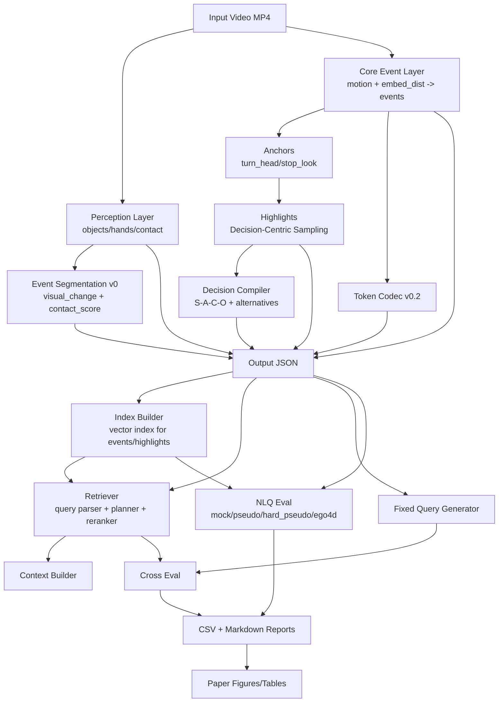

# Architecture

This document summarizes POV Compiler v0.2.0 architecture and data flow.

## Layered Stack

## Main Runtime Paths

1. Single-video offline compile:
- `scripts\run_offline.py` -> output JSON with `events/highlights/tokens/decision_points/perception/events_v0`.

2. Retrieval path:
- `scripts\build_index.py` -> `.index.npz + .index_meta.json`.
- `scripts\retrieve.py` or `scripts\build_context.py --query ...`.

3. Evaluation path:
- `scripts\gen_queries.py` -> fixed `queries.jsonl`.
- `scripts\eval_cross.py` -> cross-variant CSVs and report.
- `scripts\eval_nlq.py` -> NLQ CSVs and report.

4. Batch orchestration:
- `scripts\ego4d_smoke.py` runs scan/sample/proxy(optional)/run_offline/index/eval/nlq/perception.

## Core Interfaces

- Perception backend protocol:
  - `detect(frame_bgr, frame_index, t) -> {objects, hands}`.
  - implementations: `stub`, `real`.
- Vector index interface:
  - add/search/save/load.
- Retriever interface:
  - structured query parse + selection + reranking.
- Context builder:
  - mode-based, budget-controlled output subset.

## Config Surfaces

- `configs/default.yaml`
  - pipeline defaults, perception toggles, retrieval/eval budgets.
- `configs/perception_default.yaml`
  - perception-specific defaults.
- `configs/rerank_default.yaml`
  - reranker weights.
- `configs/hard_constraints_default.yaml`
  - hard-filter and relax fallback behavior.
